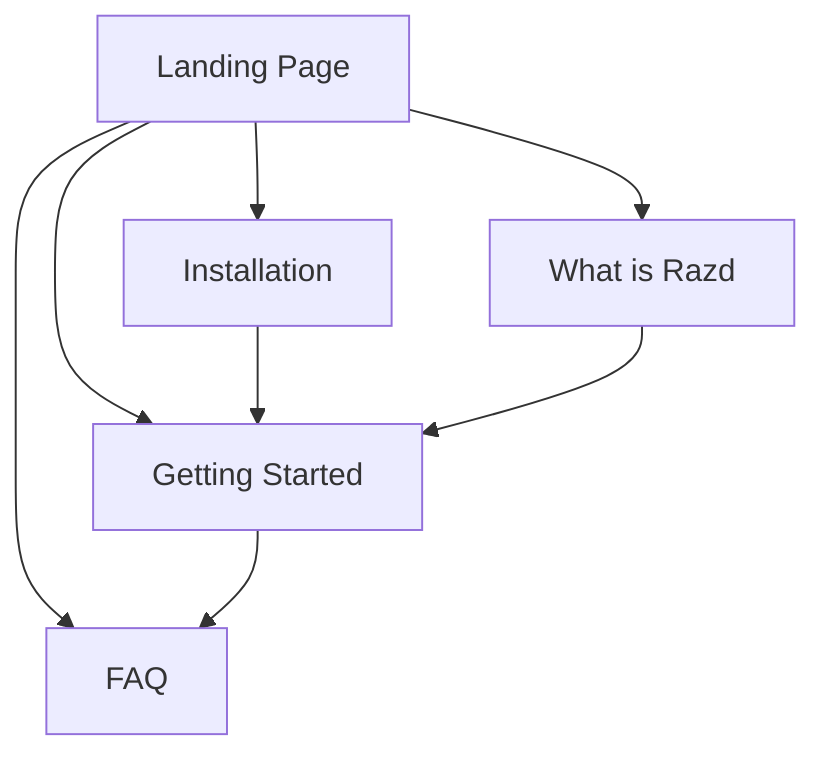

# Design: Comprehensive Documentation System

## Architecture Overview

The documentation system will be built as a modern, static site that provides comprehensive coverage of razd-cli functionality while maintaining excellent user experience and maintainability.

## Design Decisions

### 1. Documentation Framework: VitePress

**Decision**: Use VitePress for the documentation site

**Rationale**:
- **Performance**: Fast builds and runtime, optimized for static content
- **Developer Experience**: Markdown-based with Vue.js components for interactivity
- **Theming**: Built-in responsive themes with customization options
- **Search**: Built-in search functionality
- **Ecosystem**: Active development and good community support

**Alternatives Considered**:
- Docusaurus: More complex setup, React-based
- GitBook: Less control over hosting and customization
- Custom solution: Higher maintenance burden

### 2. Content Architecture

**Decision**: Flat, minimalist structure focused on essential user journeys

**Structure**:
```
docs/
├── index.md              # Hero landing page with quick example
├── getting-started.md    # Quick start tutorial
├── faq.md               # FAQ and troubleshooting
├── guide/
│   └── index.md         # "What is Razd?" explanation
└── installation/
    └── index.md         # Multi-platform installation
```

**Rationale**:
- **Simplicity First**: Minimal structure reduces cognitive load
- **Fast Navigation**: Users reach any page within 1-2 clicks
- **Essential Content Only**: Focus on getting users productive quickly
- **Easy Maintenance**: Fewer files mean easier updates and consistency
- **Room to Grow**: Can expand into subdirectories as needs evolve

**Content Priority**:
1. Landing page with value proposition
2. Installation guide (critical blocker)
3. Getting started (first success)
4. FAQ (self-service support)
5. What is Razd (conceptual understanding)

### 3. Content Strategy

**Decision**: Focus on practical, minimal documentation that gets users productive fast

**Principles**:
- **Just Enough**: Cover essential user journeys without overwhelming
- **Quick Wins**: Prioritize time-to-first-success
- **Self-Service**: FAQ answers common questions to reduce support burden
- **Copy-Pastable**: Code samples users can immediately use
- **Visual Appeal**: Hero page with clear value proposition

**Pages and Purpose**:
1. **Landing (`index.md`)**: Convince users of value, show quick example
2. **Installation (`installation/index.md`)**: Remove setup barriers
3. **Getting Started (`getting-started.md`)**: First successful project setup
4. **What is Razd (`guide/index.md`)**: Explain concepts and how it works
5. **FAQ (`faq.md`)**: Answer questions, troubleshoot issues

### 4. Information Architecture



**User Journeys**:
1. **First-time User**: Landing → Installation → Getting Started
2. **Curious Developer**: Landing → What is Razd → Installation → Getting Started
3. **Problem Solver**: FAQ (direct access via search)

**Navigation Philosophy**:
- Maximum 2 clicks to any content
- No deep hierarchies
- Clear entry points from landing page
- Search as primary discovery mechanism

### 5. Technical Implementation

**Hosting**: GitHub Pages
- **Benefits**: Free, integrated with repository, automatic deployments possible
- **Current State**: Manual deployment, can automate later if needed

**Build System**:
- VitePress with npm/pnpm scripts
- Catppuccin theme (Mocha for dark, Latte for light)
- Built-in search (local search provider)
- Custom Vue components if needed (currently using standard markdown)

**Deployment Process** (Current - Manual):
```bash
# Build the site
pnpm run docs:build

# Preview locally
pnpm run docs:preview

# Deploy (manual push to gh-pages or via GitHub Pages settings)
```

**Future CI/CD Pipeline** (Out of Scope for MVP):
```yaml
# Documentation deployment workflow
on:
  push:
    branches: [main]
    paths: ['docs/**']
  
jobs:
  deploy:
    - Build VitePress site
    - Run link checking
    - Deploy to GitHub Pages
```

**Performance Optimizations**:
- Static site generation (pre-rendered HTML)
- Code splitting and lazy loading
- Optimized images and assets
- CDN delivery via GitHub Pages

**Search Strategy**:
- Built-in VitePress search for basic functionality
- Consider Algolia DocSearch for advanced search features
- Ensure all content is properly indexed

### 6. Content Maintenance Strategy

**Automation**:
- **Example Testing**: CI runs all code examples to ensure they work
- **Link Checking**: Automated detection of broken internal/external links
- **Version Synchronization**: Automatic updates when CLI version changes

**Content Lifecycle**:
1. **Creation**: New features trigger documentation requirements
2. **Review**: Technical and editorial review before publication
3. **Maintenance**: Regular audits and user feedback integration
4. **Deprecation**: Clear migration paths for outdated content

## Quality Standards

### Content Quality
- **Accuracy**: All examples must be tested and work
- **Completeness**: Every user-facing feature documented
- **Clarity**: Written for developers of all experience levels
- **Currency**: Updated within one release cycle of changes

### Technical Quality
- **Performance**: <2 second page load times
- **Accessibility**: WCAG 2.1 AA compliance
- **Mobile**: Responsive design for all screen sizes
- **SEO**: Proper meta tags and structure for discoverability

### User Experience
- **Navigation**: Clear, consistent navigation patterns
- **Search**: Users can find relevant content quickly
- **Feedback**: Mechanisms for users to report issues or suggest improvements
- **Progressive Enhancement**: Works without JavaScript for basic functionality

## Success Metrics

### Quantitative Metrics
- Page load time: <2 seconds (95th percentile)
- Search success rate: >80% find relevant content in first 3 results
- Documentation coverage: 100% of CLI commands and major features
- User task completion: >90% can complete installation following docs

### Qualitative Metrics
- User satisfaction surveys: >4.5/5 average rating
- Community feedback: Positive sentiment in issues and discussions
- Adoption indicators: Increased tool usage after documentation improvements
- Support burden: Reduced repetitive questions in issues

## Risk Mitigation

### Content Drift
**Risk**: Documentation becomes outdated as software evolves
**Mitigation**: Automated testing of examples, CI checks for documentation updates

### Maintenance Burden
**Risk**: Documentation requires too much ongoing effort
**Mitigation**: Automation, clear contribution guidelines, community involvement

### User Confusion
**Risk**: Poor information architecture leads to lost users
**Mitigation**: User testing, clear navigation, progressive disclosure

### Technical Debt
**Risk**: Documentation infrastructure becomes difficult to maintain
**Mitigation**: Use well-supported frameworks, keep customizations minimal