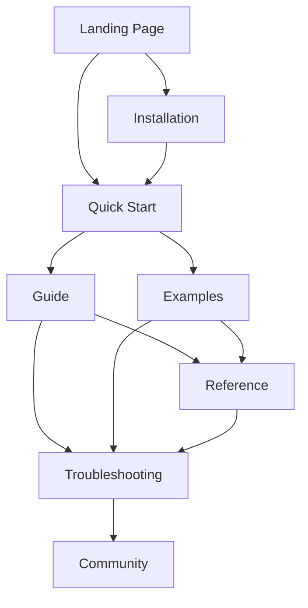

# Design: Comprehensive Documentation System

## Architecture Overview

The documentation system will be built as a modern, static site that provides comprehensive coverage of razd-cli functionality while maintaining excellent user experience and maintainability.

## Design Decisions

### 1. Documentation Framework: VitePress

**Decision**: Use VitePress for the documentation site

**Rationale**:
- **Performance**: Fast builds and runtime, optimized for static content
- **Developer Experience**: Markdown-based with Vue.js components for interactivity
- **Theming**: Built-in responsive themes with customization options
- **Search**: Built-in search functionality
- **Ecosystem**: Active development and good community support

**Alternatives Considered**:
- Docusaurus: More complex setup, React-based
- GitBook: Less control over hosting and customization
- Custom solution: Higher maintenance burden

### 2. Content Architecture

**Decision**: Hierarchical structure with clear user journey paths

**Structure**:
```
docs/
├── index.md                 # Landing page
├── installation/            # Platform-specific installation guides
├── getting-started/         # Quick start and first steps
├── guide/                   # Comprehensive feature documentation
├── reference/               # Command and configuration reference
├── examples/               # Real-world use cases and examples
├── troubleshooting/        # FAQ and problem resolution
└── community/              # Contributing and support
```

**Rationale**:
- **Progressive Disclosure**: Start simple, add complexity as needed
- **Task-Oriented**: Organized around what users want to accomplish
- **Reference vs. Guide**: Clear separation between learning and lookup

### 3. Content Strategy

**Decision**: Focus on practical, example-driven documentation

**Principles**:
- **Show, Don't Tell**: Every concept includes working examples
- **Copy-Pastable**: Code samples that users can immediately use
- **Real-World**: Examples based on actual project setups
- **Troubleshooting-First**: Anticipate and address common issues

### 4. Information Architecture



**User Journeys**:
1. **First-time User**: Landing → Installation → Quick Start → Examples
2. **Feature Explorer**: Guide → Reference → Examples
3. **Problem Solver**: Troubleshooting → Reference → Community

### 5. Technical Implementation

**Hosting**: GitHub Pages with custom domain
- **Benefits**: Free, integrated with repository, automatic deployments
- **Drawbacks**: Limited to static content (acceptable for documentation)

**CI/CD Pipeline**:
```yaml
# Documentation deployment workflow
on:
  push:
    branches: [main]
    paths: ['docs/**']
  
jobs:
  deploy:
    - Build VitePress site
    - Run link checking
    - Test example code
    - Deploy to GitHub Pages
```

**Search Strategy**:
- Built-in VitePress search for basic functionality
- Consider Algolia DocSearch for advanced search features
- Ensure all content is properly indexed

### 6. Content Maintenance Strategy

**Automation**:
- **Example Testing**: CI runs all code examples to ensure they work
- **Link Checking**: Automated detection of broken internal/external links
- **Version Synchronization**: Automatic updates when CLI version changes

**Content Lifecycle**:
1. **Creation**: New features trigger documentation requirements
2. **Review**: Technical and editorial review before publication
3. **Maintenance**: Regular audits and user feedback integration
4. **Deprecation**: Clear migration paths for outdated content

## Quality Standards

### Content Quality
- **Accuracy**: All examples must be tested and work
- **Completeness**: Every user-facing feature documented
- **Clarity**: Written for developers of all experience levels
- **Currency**: Updated within one release cycle of changes

### Technical Quality
- **Performance**: <2 second page load times
- **Accessibility**: WCAG 2.1 AA compliance
- **Mobile**: Responsive design for all screen sizes
- **SEO**: Proper meta tags and structure for discoverability

### User Experience
- **Navigation**: Clear, consistent navigation patterns
- **Search**: Users can find relevant content quickly
- **Feedback**: Mechanisms for users to report issues or suggest improvements
- **Progressive Enhancement**: Works without JavaScript for basic functionality

## Success Metrics

### Quantitative Metrics
- Page load time: <2 seconds (95th percentile)
- Search success rate: >80% find relevant content in first 3 results
- Documentation coverage: 100% of CLI commands and major features
- User task completion: >90% can complete installation following docs

### Qualitative Metrics
- User satisfaction surveys: >4.5/5 average rating
- Community feedback: Positive sentiment in issues and discussions
- Adoption indicators: Increased tool usage after documentation improvements
- Support burden: Reduced repetitive questions in issues

## Risk Mitigation

### Content Drift
**Risk**: Documentation becomes outdated as software evolves
**Mitigation**: Automated testing of examples, CI checks for documentation updates

### Maintenance Burden
**Risk**: Documentation requires too much ongoing effort
**Mitigation**: Automation, clear contribution guidelines, community involvement

### User Confusion
**Risk**: Poor information architecture leads to lost users
**Mitigation**: User testing, clear navigation, progressive disclosure

### Technical Debt
**Risk**: Documentation infrastructure becomes difficult to maintain
**Mitigation**: Use well-supported frameworks, keep customizations minimal